# Pour-Grocery-Mobile-Application

## App Description
Pour Grocery is a mobile application developed for the Android platform using React Native. The app provides a seamless grocery delivery service in Malaysia, prioritizing convenience and quality for its users.

## Tools, Platforms, and Frameworks Used
- **Visual Studio Code:** Source code editor used on desktop.
- **Node.js:** A cross-platform, back-end JavaScript runtime environment that executes JavaScript code outside a web browser.
- **SQLite3:** A relational database management system (RDBMS) contained in a C library, use directly with the end program.
- **Postman:** An API client used for creating and testing API connections with database.
- **Flask:** An application framework used to create and transfer HTML or other markup languages between the web server and application via HTTP requests.

## Pages Included

- **User Side:**
  - **Authentication:** `LoginScreen.js`, `RegisterScreen.js`
  - **Shopping:** `Home.js`, `Product.js`, `Cart.js`, `Payment.js`
  - **Profile Management:** `Account.js`, `EditAccount.js`

- **Admin Side:**
  - **Product Management:** `AProduct.js`, `ACategory.js`
  - **Admin Profile Management:** `Account.js`, `EditAccount.js`

- **Common UI Elements - Shared components:**
  - **Custom_Pay.js:** `CheckButton`, `FeeDisplay` - used across multiple pages for payment and authentication.
  - **Custom_Product.js:** Used in `Product.js` for product listing and details.
  - **GlobalStyle.js:** Global styling applied across various pages.
  - **Colors.js:** Common color themes used throughout the app.

## Data Persistence

The web server is configured to handle three primary tables and stored in the application, includes:

- **Grocery**: Used in the Home and AProduct pages.
- **Category**: Used in the Home and ACategory pages.
- **User**: Used in the Account, EditAccount, Login, and Register pages.

`State variables` are employed to manage the application's data dynamically. When the user accesses the home page, these variables are initialized (often set to null or empty). After fetching data from `SQLite`, the state variables capture this data to render it on the app's screen.

## App Connectivity to Cloud

`Flask` web-based API is implemented to manage data on a web server, allowing our app to interact with the server over the internet via HTTP. This API manipulates the data stored in the SQLite database. Flask, a Python framework, was set up for our web service program, and we used Postman to test and validate the API connection before integrating it into our application.

## Demo Output

### User Side

1. **Login and Register**
   
   - This is the initial screen where users can log in with their email and password. Fields are validated to ensure they are not empty, and users receive error messages if credentials are incorrect or if the user does not exist in the database.  New users can register by providing their name, email, address, and password. The system checks for required fields, displaying error messages for invalid inputs. Upon successful registration, users are redirected to the login page.

  
  

2. **Home Page**
   
   - After logging in, users can browse all available products, filter by category (e.g., fresh produce, dairy, canned foods), or search for specific items. Products are displayed in a grid format and dynamically updated based on the user’s selections. The user may also use the refresh button below the search bar to reset the filters.

  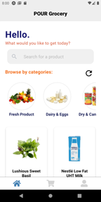
  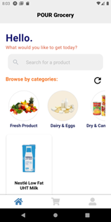
  

3. **Product Detail**
   
   - Users can view detailed information about a specific product, including its name, price, category, and an enlarged image, providing a clearer understanding of the product. Subsequently, the user can add the product to cart.
     

  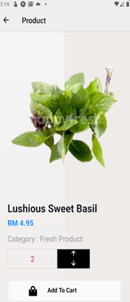
  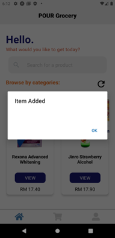

4. **Cart and Payment**
   
   - This page displays selected products for purchase, allowing users to adjust quantities and view the total price before proceeding to payment. Upon completing a purchase, the cart is cleared. The payment page shows the total cost, including delivery charges, and allows users to choose a payment method from options like Credit/Debit card, TouchNGo, Cash, or Online Banking to complete the purchase.

  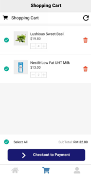
  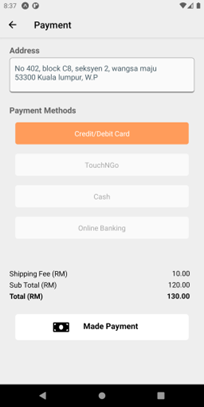

5. **Account Page**
   
   - This page displays personal information like username, delivery address, and email. It also provides options to edit account details or log out.

  

### Admin Side

1. **Product Page**
   - This page is used to manage products. Admins can search for products, add new items, view, edit existing product information, or delete products as needed.

  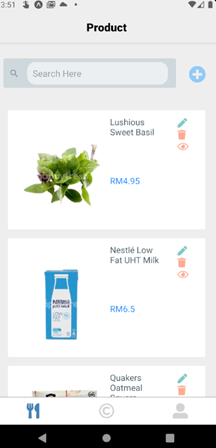
  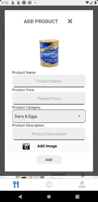
   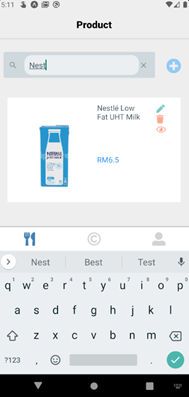

2. **Category Page**
   - This allows admins to manage product categories, including adding, editing, and deleting categories. Admins can also view the products within each category and perform searches to find specific categories or products.

  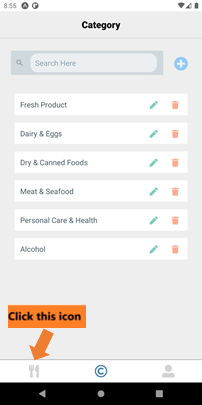
  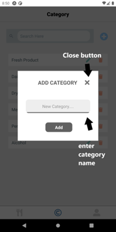

## Contributors
-  Vicrace Chan Jia Lin
-  Lim Yan Qian
-  Goh Way Siang
-  Tan Carlson
-  Tan Eong Seang

